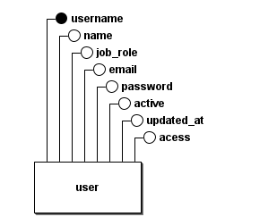
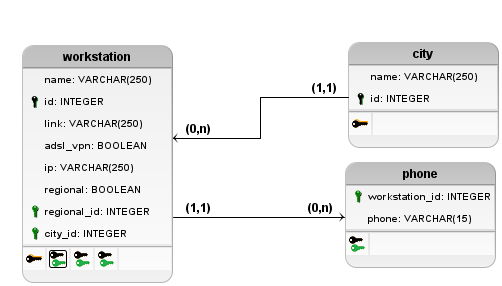
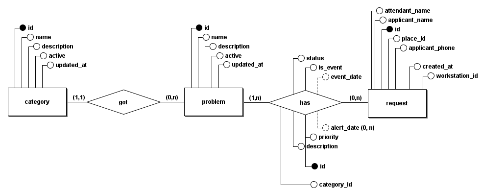
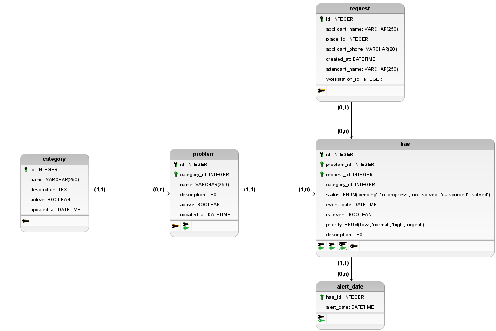

# Diagramas de Bancos de Dados

O intuito deste documento é apresentar os diagramas de banco de dados do projeto. 

O diagrama de banco de dados é uma representação gráfica de um banco de dados, que mostra como os dados estão relacionados entre si. O diagrama de banco de dados é uma ferramenta importante para o desenvolvimento de um banco de dados, pois permite que o desenvolvedor visualize o banco de dados antes de criá-lo. O diagrama de banco de dados também é útil para o usuário, pois permite que ele visualize o banco de dados antes de usá-lo.

O projeto conta com 3 microserviços de backend e 1 frontend que utiliza-os.

- Gestor de usuários
- Gerenciador de Localidades
- Detalhador de chamados
- front

Cada microserviço  de backend possui um diagrama de banco de dados, que é apresentado a seguir:

### Histórico da Revisão
| Data       | Versão | Descrição                    | Autor                   |
| ---------- | ------ | ---------------------------- | ----------------------- |
| 18/09/2022 | 1.0    | Criação do documento         | Roberto Martins da Nóbrega      |

## Diagrama Entidade-Relacionamento (DE-R) - Gestor de Usuários

## Diagrama Lógico de Dados (DLD) - Gestor de Usuários

## Diagrama Entidade-Relacionamento (DE-R) - Gerenciador de Localidades

## Diagrama Lógico de Dados (DLD) - Gerenciador de Localidades

## Diagrama Entidade-Relacionamento (DE-R) - Detalhador de Chamados

## Diagrama Lógico de Dados (DLD) - Detalhador de Chamados

