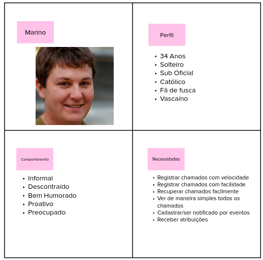
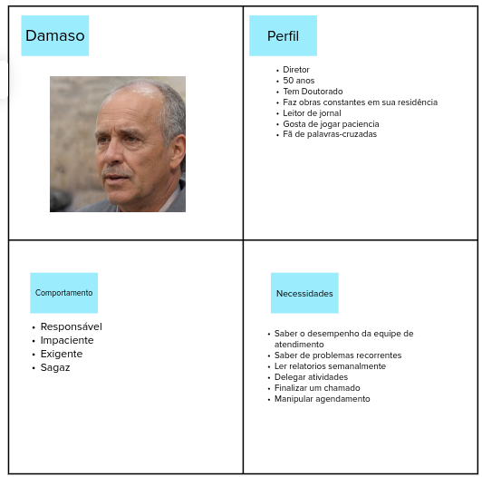
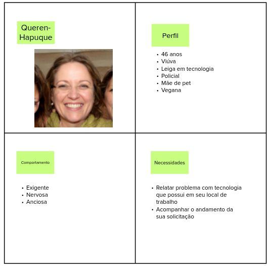

# Personas

O desenvolvimento das personas está no início do projeto, pois as personas podem informar a funcionalidade do site, ajudar a descobrir lacunas ou destacar novas oportunidades. Personas são arquétipos, personagens ficcionais, concebidos a partir da síntese de comportamentos observados entre consumidores com perfis extremos. Representam as motivações, desejos, expectativas e necessidades, reunindo características significativas de um grupo mais abrangente.

Com as seguintes etapas realizamos as personas:

* Condense a pesquisa: procure temas/características que sejam específicos, relevantes e universais para o sistema e seus usuários.

* Brainstorm: Organize os elementos em grupos de persona que representam seus usuários-alvo. Nomeie ou classifique cada grupo.

* Refinar: Combine e priorize as personas rudes. Separe-os em categorias primárias, secundárias e, se necessário, complementares. Você deve ter cerca de 3-5 personas e suas características identificadas.

* Torne-os realistas: desenvolva as descrições apropriadas do histórico, motivações e expectativas de cada persona. Não inclua muitas informações pessoais. Seja relevante e sério; o humor não é apropriado.

## Personas elicitadas

O resultado foi as personas abaixo:

### Persona 1

### Persona 2

### Persona 3

## Referências

SANTOPIXEL. Atividade: Identificando Personas - Caroli.org. Caroli.org. Disponível em: <https://www.caroli.org/atividade-identificando-personas/>. Acesso em: 9 jul. 2022.

‌SANTOPIXEL. Criar as personas (todos junto) ou trazer uma apresentação pronta? - Caroli.org. Caroli.org. Disponível em: <https://www.caroli.org/diretoaoponto-criar-as-personas-todos-junto-ou-trazer-uma-apresentacao-pronta/>. Acesso em: 9 jul. 2022.

‌FOR, Secretary. Personas | Usability.gov. Usability.gov. Disponível em: <https://www.usability.gov/how-to-and-tools/methods/personas.html>. Acesso em: 9 jul. 2022.

‌